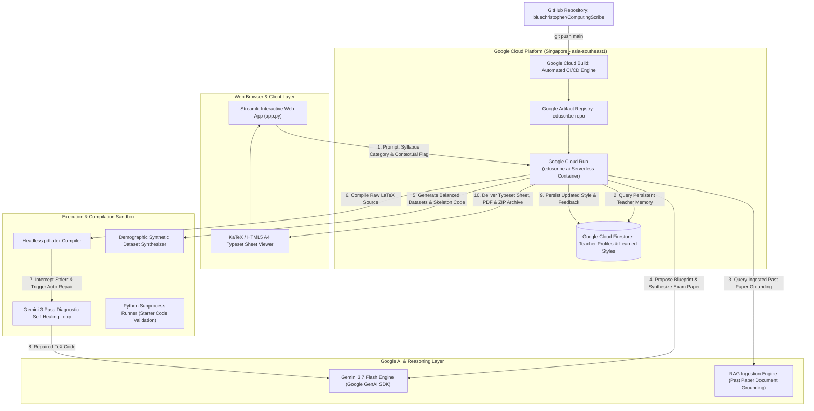

# 🎓 ComputingScribe AI

> **The adaptive co-authoring agent for technical educators:** turning syllabus standards into compiled LaTeX papers, balanced synthetic datasets, and verified mark schemes.

[](https://deepmind.google/technologies/gemini/)
[](https://cloud.google.com/vertex-ai)
[](https://cloud.google.com/run)
[](https://cloud.google.com/firestore)
[](https://www.python.org/)
[](https://streamlit.io/)
[](https://opensource.org/licenses/MIT)

---

## 🏆 1. All Things Agentic Hackathon Submission Overview

**Category:** **Collaborative Partner**  
*Build an agent that leads the way and takes notes. It should ask clarifying questions, guide the user step-by-step, and have a clear way to capture feedback, so it constantly adapts to the user's unique way of thinking.*

### 📋 Requirements Compliance Matrix

| Hackathon Requirement | ComputingScribe AI Implementation | Status |
| :--- | :--- | :---: |
| **Model** (Gemini 3.5 or newer) | **Gemini 3.7 Flash** (`gemini-3.7-flash`) powers blueprint synthesis, contextual scenario formulation, LaTeX self-healing compilation, and feedback extraction. | ✅ **Pass** |
| **Google Agent Framework** | **Google GenAI SDK (`google-genai`)** with structured JSON Pydantic schemas, multi-modal grounding, and tool execution loops. | ✅ **Pass** |
| **Google Cloud Infrastructure** | **Google Cloud Run** (serverless hosting), **Google Cloud Firestore** (persistent teacher memory), **Google Artifact Registry** (container management), and **Google Cloud Build** (CI/CD). | ✅ **Pass** |
| **Collaborative Partner Behavior** | Proactively leads with structured blueprints, asks for clarifications, accepts natural feedback (Tab 6), and adapts to the teacher's evolving style in Firestore. | ✅ **Pass** |
| **Public Code Repository** | [https://github.com/bluechristopher/ComputingScribe](https://github.com/bluechristopher/ComputingScribe) | ✅ **Pass** |
| **Reproducibility** | Full Dockerfile with headless TeXLive, automated GitHub Actions CI/CD, and zero-configuration local execution. | ✅ **Pass** |

---

## 📖 2. The Teacher's Perspective: Real-World Pain Points & Vision

### 🔍 The Core Problem: The Exhausting Reality of Authoring Technical Examinations
Setting national and institutional examinations for technical subjects like **Singapore-Cambridge GCE A-Level H2 Computing (Syllabus 9569 / 2027)** and **Cambridge AS/A-Level (9618)** is an exhausting, multi-day cognitive ordeal for computing educators. Even with generic AI chat assistants, setting a high-stakes exam paper suffers from four critical friction points:

#### 1. The Contextual Scenario Drafting Burden & Syllabus Calibration
Exam boards mandate that programming and computational questions must not be isolated abstract puzzles; they must be embedded within **realistic, rich contextual domains** (e.g. automated transit fare collection gates, hospital emergency room triage priority queues, parcel logistics fulfillment centers, or banking transaction audit ledgers).  
- Designing a plausible real-world scenario from scratch, inventing consistent domain entities, structuring companion database attributes, and ensuring that every nested subtask precisely maps to specific syllabus learning objectives and Cambridge Assessment Objectives (AO1 Knowledge, AO2 Application, AO3 Evaluation) takes days of solitary drafting and refinement.

#### 2. The Typesetting Dilemma: Microsoft Word Alignment Hell vs. LaTeX Technical Barrier
Every computing educator faces a frustrating typesetting trade-off:
- **The Microsoft Word Trap**: Word processors are fundamentally unsuitable for technical papers. Indented Python code listings lose precise indentation, monospace fonts break across pagination boundaries, tabular decision matrices and trace tables distort when columns wrap, and right-aligned mark brackets (`\hfill [4]`) shift unpredictably whenever an earlier sentence is edited.
- **The LaTeX Friction Barrier**: LaTeX is the worldwide gold standard for rigorous examination typography, clean code listing boxes, and formal headers. However, authoring in raw LaTeX requires extensive specialized knowledge. TeX syntax is notoriously unforgiving—a single unescaped underscore in a variable name (`candidate_id`), an unescaped percentage sign (`%`), or a mismatched bracket locks the compiler with cryptic errors. Colleagues without TeX expertise cannot contribute to or maintain exam repositories.

#### 3. The Synthetic Dataset Fabrication & Demographic Integrity Burden
Lab-based practical programming examinations require authentic companion test datasets (e.g. `CANDIDATES.csv`, sensor streams, relational SQL schemas) for candidate file-processing tasks.  
- Handcrafting realistic test records with varied boundary values (valid, extreme, abnormal cases) is tedious and error-prone.
- Crucially, manually generated datasets frequently introduce unintended demographic biases, stereotypical roles, or culturally skewed naming pools.

#### 4. The Amnesiac Chatbot Dilemma (Lack of Pedagogical Memory)
Generic LLM chat interfaces suffer from persistent amnesia. They do not retain institutional formatting conventions, cannot remember an educator's preferred rubric granularity, and fail to track evolving pedagogical preferences across different syllabus modules. Teachers find themselves re-prompting, re-explaining, and manually cleaning up AI outputs on every attempt.

---

### 🎯 What I Hoped to Achieve: The Autonomous Collaborative Partner
As a computing teacher, my goal was to build a true **Collaborative Pedagogical Partner**—an agent that acts as an expert co-examiner that:
1. **Leads the authoring process step-by-step**: Formulates balanced exam blueprints and mark distributions before touching code, expands prompts into rich real-world contextual scenarios, and generates clear, step-by-step bulleted subtasks for practical papers.
2. **Generates deep contextual problems on command**: Produces well-developed domain narratives for theory papers and activates contextual scenario generation when triggered by the word `'contextual'`.
3. **Democratizes publication-grade LaTeX for all educators**: Completely eliminates the LaTeX learning curve. The agent writes authentic Cambridge TeX code, executes headless compilation inside a containerized sandbox, and self-heals broken syntax automatically using **Gemini 3.7 Flash** reflection loops.
4. **Guarantees algorithmic fairness & demographic parity**: Automatically balances synthetic datasets with 50/50 gender splits and authentic multiracial Singapore naming distributions (Chinese, Malay, Indian, Eurasian, Caucasian), while generating companion demographic datasets.
5. **Continuously learns the teacher's unique voice**: Remembers educator feedback and phrasing preferences across every syllabus module in **Google Cloud Firestore**, evolving into a tailored co-authoring partner for entire departments.
6. **Renders on-screen typeset papers with zero LaTeX expertise required**: Lets educators preview authentic Cambridge A4 exam sheets with KaTeX math, Jupyter cells, pseudocode line numbers, and mark brackets, then export production-ready `.pdf` and `.tex` packages with a single click.

---

## 🏗️ 3. System Architecture Diagram



---

## 🤝 4. How Google Cloud and AI Agents Work Together in Synergy

ComputingScribe AI demonstrates deep architectural synergy between **Google Cloud infrastructure** and **agentic reasoning patterns**:

| Google Cloud Service | Role in Agentic Workflow | Synergy Mechanism |
| :--- | :--- | :--- |
| **Gemini 3.7 Flash** | **Cognitive Agent Brain** | Handles multi-step reasoning: deconstructs prompts into structured blueprints, synthesizes Cambridge LaTeX markup, diagnoses compiler error logs, and extracts pedagogical rules from educator feedback. |
| **Google GenAI SDK** | **Agentic Tool & Schema Layer** | Enforces structured Pydantic JSON schemas, coordinates multi-modal RAG past-paper grounding, and orchestrates tool calling across data generators. |
| **Google Cloud Firestore** | **Persistent Long-Term Agent Memory** | Acts as the agent's memory cortex (`teacher_profiles/{teacher_id}`). Persists learned styles (question depth, rubric granularity, custom phrasing directives) across user sessions so the agent continuously adapts. |
| **Google Cloud Run** | **Serverless Execution Runtime** | Hosts the containerized application in Singapore (`asia-southeast1`). Scales dynamically from zero to handle compute-intensive LaTeX compilation without persistent server overhead. |
| **Google Cloud Build & Artifact Registry** | **Automated CI/CD Pipeline** | Builds the production container with full headless TeXLive packages and deploys automatically on every `git push` to `main`. |

### The 5-Step Autonomous Agent Lifecycle:
1. **Memory & Style Retrieval**: Agent queries Firestore for the educator's category profile (e.g. `sec1_linear_adts` preference for `long_contextual` scenarios with bulleted subtasks).
2. **Blueprint Synthesis**: Gemini 3.7 Flash formulates a structured syllabus-aligned blueprint with balanced point distributions.
3. **Multi-Artifact Generation**: Parallel generation of Cambridge LaTeX source, demographically balanced companion CSV datasets (`CANDIDATES.csv`), and starter Python scripts.
4. **Self-Healing Sandbox**: Headless `pdflatex` compiles the paper; if syntax errors occur, Gemini intercepts the error log, repairs the code, and retries in an automatic 3-pass loop.
5. **Continuous Learning**: The educator reviews the draft and provides feedback (Tab 6), which Gemini extracts and updates in Firestore for future generations.

---

## ✨ 5. Deep Feature Breakdown & Capabilities

### 1. Collaborative Blueprint Authoring & Syllabus Calibration
- **Structured Pre-Authoring Phase**: Before generating raw LaTeX or code, EduScribe AI formulates a structured **Exam Blueprint** (learning objectives, Assessment Objective weighting, task breakdowns, mark schemes).
- **Interactive Verification**: Teachers review and adjust mark allocations and question distributions before committing to compilation.

### 2. The `'contextual'` Deep Scenario Engine
- **Intelligent Keyword Trigger**: Simply including the word `'contextual'` in any prompt instructs the agent to elevate the depth of the generated assessment:
  - **For Practical Papers (Paper 2)**: Builds an authentic, extended domain scenario (e.g. MRT automated fare gates, hospital patient triage queues, e-commerce warehouse robotics) and breaks subtasks down into **clear, structured bulleted point instructions** with explicit method signatures, parameter types, boundary conditions, and sample console executions.
  - **For Theory Papers (Paper 1)**: Constructs a **multi-paragraph domain narrative** establishing business rules, relational schemas, network packet routes, and data protection constraints that ground all subsequent question parts.

### 3. Full Dual Paper Support (H2 Computing 2027 / 9569 Standards)
- **Paper 2 (Lab-Based Practical — 100 Marks)**: Generates 4 Python programming tasks (`\maintask{1}` to `\maintask{4}`), Jupyter input cells (`\jupytercell`), demographically balanced test datasets (`CANDIDATES.csv`), SQL schema scripts (`SCHEMA.sql`), and starter skeleton code (`starter_task.py`).
- **Paper 1 (Written Theory — 100 Marks)**: Generates structured questions, Cambridge pseudocode listings with two-digit line numbering (`01`, `02`, ...), decision tables with boundary conditions, trace tables, SQL queries, network subnetting calculations, and ethical analysis questions.

### 4. Demographic Fairness & Synthetic Data Synthesizer
- **Automated Demographic Guardrails**: Eliminates the risk of cultural or gender bias in companion datasets:
  - **Strict 50/50 Gender Parity** across synthetic candidate rosters.
  - **Multiracial Regional Representation**: Balanced sampling across Chinese, Malay, Indian, Eurasian, and Caucasian naming pools representative of Singapore and Southeast Asian student cohorts.
  - **Telemetry Dashboard**: Visual telemetry cards verify balanced cohort metrics in real time.

### 5. Self-Healing pdflatex Compilation Sandbox & Live Typeset A4 Sheets
- **3-Pass Diagnostic Auto-Repair Loop**: Headless `pdflatex` compiles LaTeX code inside the Docker container. If compilation errors occur (unescaped symbols, syntax locks), Gemini 3.7 Flash captures the stderr log, diagnoses the exact error, repairs the TeX code, and retries automatically.
- **In-Browser Publication-Grade Typeset Sheet**: For educators without TeX installed locally, EduScribe AI renders an authentic Cambridge A4 exam sheet directly in the browser using KaTeX, complete with running headers, page numbers, Jupyter code frames, and right-aligned mark brackets (`\hfill [4]`).

### 6. Continuous Pedagogical Memory & Phrasing Refinement (Tab 6)
- **Direct Educator Feedback Loop**: Teachers can input natural-language feedback after reviewing a draft (e.g. *"Make subtask instructions more granular with explicit return types"* or *"Always include docstring requirements in OOP tasks"*).
- **Firestore Persistence**: Gemini extracts structured pedagogical rules and stores them under the educator's persistent profile (`teacher_profiles/{teacher_id}`) in **Google Cloud Firestore**. Future generations automatically adapt to the teacher's voice.
- **RAG Past Paper Grounding**: Teachers can upload past prelim papers (`.pdf`, `.docx`, `.tex`) to ground the agent in their school's specific institutional tone.

### 7. One-Click Multi-Artifact Export Bundle
- Instantly packages a production-ready `.zip` archive containing:
  - `paper.pdf` & `paper.tex` (Exam Question Paper)
  - `mark_scheme.pdf` & `mark_scheme.tex` (Official Cambridge Mark Scheme)
  - `CANDIDATES.csv` & `SCHEMA.sql` (Companion Test Datasets)
  - `starter_task.py` (Candidate Skeleton Code)
  - `blueprint.json` (Structured Assessment Metadata)

---

## 📚 6. Technologies, Curricula & Styling References

### Technology Stack
- **Google AI**: Gemini 3.7 Flash (`gemini-3.7-flash`), Google GenAI SDK (`google-genai`).
- **Google Cloud Platform**: Google Cloud Run, Google Cloud Firestore, Google Cloud Build, Google Artifact Registry.
- **Frontend & Typesetting**: Streamlit, KaTeX, TeXLive (`pdflatex`), FPDF2, Pydantic, PyPDF, Python-Docx.

### Curricula & Styling References
1. **Singapore-Cambridge GCE A-Level H2 Computing (Syllabus 9569 / 2027)**:
   - Section 1: Data and Data Structures (Linear & Non-Linear ADTs, BST, Hash Tables).
   - Section 2: Algorithms and Problem Solving (Quicksort, Merge sort, Decision tables, Big-O Complexity).
   - Section 3: System Design & Implementation (Python 3, OOP Polymorphism, 1NF-3NF Relational DBs, Flask, Networks & Subnetting).
   - Section 4: Ethics, Legislation & Emerging Tech (PDPA, AI Ethics, Cybersecurity).
2. **Cambridge International AS & A Level Computer Science (9618)**:
   - Command word taxonomy, tabular mark scheme rubrics, and pseudocode standards.
3. **Past Singapore-Cambridge A-Level Computing Papers & Marking Styling References**:
   - Authentic typographic layouts, nested task structures (`Task 1.1`, `Task 1.2`), right-aligned mark brackets (`\hfill [3]`), code listing boxes, and standard marking guidance conventions.

---

## ☁️ 7. Step-by-Step Guide: How to Host & Deploy to Google Cloud

You can deploy ComputingScribe AI to Google Cloud Platform using either **Automated GitHub Actions CI/CD** (recommended) or **Google Cloud Shell CLI**.

---

### Method 1: Automated GitHub Actions CI/CD to Cloud Run (Recommended)

Whenever you push to the `main` branch, the workflow in `.github/workflows/deploy.yml` will automatically build the container and deploy to Google Cloud Run.

#### Step 1: Enable Google Cloud APIs
In **[Google Cloud Shell](https://shell.cloud.google.com/)**, run:
```bash
gcloud config set project YOUR_PROJECT_ID

gcloud services enable \
  run.googleapis.com \
  artifactregistry.googleapis.com \
  cloudbuild.googleapis.com \
  firestore.googleapis.com
```

#### Step 2: Create a Service Account for GitHub Actions
In Google Cloud Shell:
```bash
# 1. Create service account
gcloud iam service-accounts create github-deployer \
  --description="GitHub Actions Deployer" \
  --display-name="github-deployer"

# 2. Grant required deployment roles
gcloud projects add-iam-policy-binding YOUR_PROJECT_ID \
  --member="serviceAccount:github-deployer@YOUR_PROJECT_ID.iam.gserviceaccount.com" \
  --role="roles/run.admin"

gcloud projects add-iam-policy-binding YOUR_PROJECT_ID \
  --member="serviceAccount:github-deployer@YOUR_PROJECT_ID.iam.gserviceaccount.com" \
  --role="roles/artifactregistry.admin"

gcloud projects add-iam-policy-binding YOUR_PROJECT_ID \
  --member="serviceAccount:github-deployer@YOUR_PROJECT_ID.iam.gserviceaccount.com" \
  --role="roles/cloudbuild.builds.editor"

gcloud projects add-iam-policy-binding YOUR_PROJECT_ID \
  --member="serviceAccount:github-deployer@YOUR_PROJECT_ID.iam.gserviceaccount.com" \
  --role="roles/storage.admin"

gcloud projects add-iam-policy-binding YOUR_PROJECT_ID \
  --member="serviceAccount:github-deployer@YOUR_PROJECT_ID.iam.gserviceaccount.com" \
  --role="roles/iam.serviceAccountUser"

# 3. Generate Service Account JSON Key
gcloud iam service-accounts keys create key.json \
  --iam-account=github-deployer@YOUR_PROJECT_ID.iam.gserviceaccount.com
```

#### Step 3: Add Repository Secrets in GitHub
1. Go to your GitHub repo: **Settings** > **Secrets and variables** > **Actions** > **New repository secret**.
2. Add these 3 secrets:
   - `GCP_PROJECT_ID`: Your Google Cloud Project ID.
   - `GCP_SA_KEY`: Paste the entire contents of the `key.json` file.
   - `GEMINI_API_KEY`: Your Google Gemini API Key.

#### Step 4: Push to Main & Watch Live Deployment
Push any commit to `main` (via GitHub Desktop or CLI). GitHub Actions will build the Docker container and deploy to **Cloud Run**, outputting your public HTTPS URL!

---

### Method 2: Direct 1-Click Deployment via Google Cloud Shell CLI

If you prefer to deploy directly from the command line without GitHub Secrets:

1. Open **[Google Cloud Shell](https://shell.cloud.google.com/)**.
2. Run the following commands:
```bash
# 1. Clone the repository
git clone https://github.com/bluechristopher/ComputingScribe.git
cd ComputingScribe

# 2. Deploy directly to Cloud Run using Cloud Build
gcloud run deploy eduscribe-ai \
  --source . \
  --region=asia-southeast1 \
  --platform=managed \
  --allow-unauthenticated \
  --memory=2Gi \
  --cpu=2 \
  --port=8501 \
  --set-env-vars="GEMINI_API_KEY=YOUR_GEMINI_API_KEY"
```

Once deployment completes, Cloud Run will print your live **Service URL** (e.g. `https://eduscribe-ai-xxxxxx-as.a.run.app`).

---

### Method 3: Run Locally via Docker (Full TeXLive Included)

```bash
# 1. Clone repository
git clone https://github.com/bluechristopher/ComputingScribe.git
cd ComputingScribe

# 2. Build Docker container
docker build -t eduscribe-ai .

# 3. Run container
docker run -p 8501:8501 -e GEMINI_API_KEY="YOUR_GEMINI_API_KEY" eduscribe-ai

# 4. Open in browser
http://localhost:8501
```

---

### Method 4: Local Python Virtual Environment

```powershell
# 1. Create and activate virtual environment
python -m venv venv
.\venv\Scripts\Activate.ps1   # On Linux/macOS: source venv/bin/activate

# 2. Install dependencies
pip install -r requirements.txt

# 3. Set environment variable
$env:GEMINI_API_KEY="YOUR_GEMINI_API_KEY"   # On Linux/macOS: export GEMINI_API_KEY="YOUR_KEY"

# 4. Run automated test suite
python -m unittest tests/test_pipeline.py

# 5. Launch Streamlit application
streamlit run frontend/app.py
```

---

## 🧪 8. Automated Testing & Verification

The repository includes a comprehensive automated test suite verifying all agentic modules:

```powershell
python -m unittest tests/test_pipeline.py
```

**Test Coverage Summary:**
- `test_1_demographic_fairness_dataset`: Strictly verifies 50/50 gender balance and multiracial naming distributions.
- `test_2_practical_paper_templating`: Verifies Practical paper blueprinting and LaTeX macro generation.
- `test_3_theory_paper_templating`: Verifies Theory paper blueprinting, decision tables, pseudocode, and mark schemes.
- `test_4_session_lifecycle_and_zip_export`: Verifies session saving, restoring, `.zip` archive creation, and deletion.
- `test_5_end_to_end_orchestrator`: Verifies the full 5-step autonomous agent pipeline for both Practical and Theory workflows.

---

## 📂 9. Repository Structure

```
ComputingScribe/
├── .github/workflows/
│   └── deploy.yml                   # Automated GitHub Actions CI/CD to Google Cloud Run
├── config/
│   ├── gcp_config.py                # Google Cloud Platform & Gemini client configuration
│   └── default_preferences.json     # 8 H2 Computing 2027 (9569) category style presets
├── frontend/
│   ├── app.py                       # Streamlit web application & in-browser document viewer
│   └── style.css                    # Custom CSS styling (dark sidebar, light paper sheets)
├── src/
│   ├── agent/
│   │   ├── orchestrator.py          # Central 5-step agent lifecycle coordinator
│   │   ├── preference_learner.py    # Firestore & local persistent style memory
│   │   └── session_manager.py       # Session CRUD lifecycle and .zip exporter
│   ├── generators/
│   │   ├── dataset_generator.py     # Demographic fairness synthetic dataset synthesizer
│   │   └── question_author.py       # Blueprint proposer & LaTeX question author
│   ├── ingestion/
│   │   ├── document_parser.py       # PDF/DOCX past paper ingestion parser
│   │   └── rag_retriever.py         # Grounded past paper style retriever
│   └── sandbox/
│       ├── code_executor.py         # Subprocess Python code executor
│       ├── latex_compiler.py        # Self-healing pdflatex compilation sandbox
│       └── latex_renderer.py        # In-browser KaTeX & HTML5 A4 sheet renderer
├── templates/
│   ├── cambridge_practical_template.tex # Golden Paper 2 Practical LaTeX template
│   ├── cambridge_theory_template.tex    # Golden Paper 1 Theory LaTeX template
│   └── mark_scheme_template.tex         # Official Cambridge Mark Scheme template
├── tests/
│   └── test_pipeline.py             # Automated unit & integration test suite
├── Dockerfile                       # Production container with TeXLive and Python 3.11
├── requirements.txt                 # Pinned dependencies (google-genai, streamlit, etc.)
├── DEPLOYMENT.md                    # Detailed deployment documentation
└── README.md                        # Master Project Documentation & Hackathon Submission
```

---

## 📄 License
This project is licensed under the [MIT License](LICENSE).
