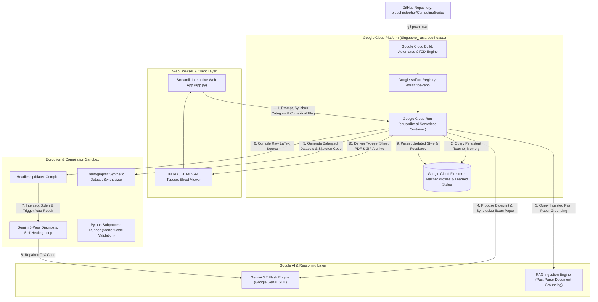

# 🎓 EduScribe AI (ComputingScribe)

> **The adaptive co-authoring agent for technical educators:** turning syllabus standards into compiled LaTeX papers, balanced synthetic datasets, and verified mark schemes.

[](https://deepmind.google/technologies/gemini/)
[](https://cloud.google.com/vertex-ai)
[](https://cloud.google.com/run)
[](https://cloud.google.com/firestore)
[](https://www.python.org/)
[](https://streamlit.io/)
[](https://opensource.org/licenses/MIT)

---

## 🌟 1. The Real-World Pain Points Solved

Setting rigorous technical examinations for subjects such as **Singapore-Cambridge GCE A-Level H2 Computing (9569 / 2027)** and **Cambridge AS/A-Level (9618)** is an exhausting, multi-hour ordeal for computing educators:

1. **Contextual Problem Drafting Burden**: Authoring authentic, high-quality contextual scenarios (e.g. transport AFC systems, triage queues, normalized database schemas) that strictly align with syllabus learning objectives and command words takes days of drafting and refinement.
2. **Typesetting Friction (Word vs LaTeX)**: 
   - **Microsoft Word** causes notorious formatting disasters—shifted code boxes, broken table borders, and misaligned margin mark brackets (`[4]`).
   - **LaTeX** produces publication-grade examination papers, but writing raw LaTeX requires steep technical expertise and extensive debugging. Many educators do not have the time or background to maintain raw TeX documents.
3. **Synthetic Dataset Fabrication Burden**: Practical programming papers require balanced, clean companion datasets (CSV records, SQL schemas). Manually creating these often introduces subtle data bugs or demographic biases.

**EduScribe AI** solves these challenges as an autonomous, persistent **Collaborative Partner** that leads the authoring process, learns the teacher's unique pedagogical style, auto-heals LaTeX syntax errors in a containerized sandbox, and delivers production-ready exam packages.

---

## 🏗️ 2. System Architecture Diagram



---

## 🤝 3. How Google Cloud and AI Agents Work Together in Synergy

EduScribe AI demonstrates deep architectural synergy between **Google Cloud infrastructure** and **agentic reasoning patterns**:

| Google Cloud Service | Role in Agentic Workflow | Synergy Mechanism |
| :--- | :--- | :--- |
| **Gemini 3.7 Flash** | **Cognitive Agent Brain** | Handles multi-step reasoning: deconstructs prompts into structured blueprints, synthesizes Cambridge LaTeX markup, diagnoses compiler error logs, and extracts pedagogical rules from educator feedback. |
| **Google GenAI SDK** | **Agentic Tool & Schema Layer** | Enforces structured Pydantic JSON schemas, coordinates multi-modal RAG past-paper grounding, and orchestrates tool calling across data generators. |
| **Google Cloud Firestore** | **Persistent Long-Term Agent Memory** | Acts as the agent's memory cortex (`teacher_profiles/{teacher_id}`). Persists learned styles (question depth, rubric granularity, custom phrasing directives) across user sessions so the agent continuously adapts. |
| **Google Cloud Run** | **Serverless Execution Runtime** | Hosts the containerized application in Singapore (`asia-southeast1`). Scales dynamically from zero to handle compute-intensive LaTeX compilation without persistent server overhead. |
| **Google Cloud Build & Artifact Registry** | **Automated CI/CD Pipeline** | Builds the production container with full headless TeXLive packages and deploys automatically on every `git push` to `main`. |

### The 5-Step Autonomous Agent Lifecycle:
1. **Memory & Style Retrieval**: Agent queries Firestore for the educator's category profile (e.g. `sec1_linear_adts` preference for `long_contextual` scenarios with bulleted subtasks).
2. **Blueprint Synthesis**: Gemini 3.7 Flash formulates a structured syllabus-aligned blueprint with balanced point distributions.
3. **Multi-Artifact Generation**: Parallel generation of Cambridge LaTeX source, demographically balanced companion CSV datasets (`CANDIDATES.csv`), and starter Python scripts.
4. **Self-Healing Sandbox**: Headless `pdflatex` compiles the paper; if syntax errors occur, Gemini intercepts the error log, repairs the code, and retries in an automatic 3-pass loop.
5. **Continuous Learning**: The educator reviews the draft and provides feedback (Tab 6), which Gemini extracts and updates in Firestore for future generations.

---

## ✨ 4. Key Features & Capabilities

- 🎯 **Dual Paper Support (H2 Computing 2027 / 9569)**:
  - **Paper 2 (Practical)**: 4 Python programming tasks, Jupyter cells (`\jupytercell`), balanced CSV datasets, and starter skeleton code.
  - **Paper 1 (Theory)**: Decision tables, structured pseudocode listings (`01`, `02`, ...), trace tables, SQL queries, and network subnetting calculations.
- 💡 **`'contextual'` Trigger Engine**: Including the keyword `'contextual'` triggers extended real-world scenario preambles and step-by-step bulleted subtask specifications for Practical papers, and well-developed domain narratives for Theory papers.
- ⚖️ **Demographic Fairness Guardrails**: Enforces **50/50 gender parity** and authentic multiracial regional naming distributions (Chinese, Malay, Indian, Eurasian, Caucasian) across synthetic CSV and SQL test datasets.
- 📜 **On-Screen Typeset Exam Paper**: Instant in-browser rendering of authentic A4 Cambridge exam sheets (with KaTeX math, Jupyter cells, pseudocode line numbers, and mark brackets) with zero local LaTeX installation required.
- 📦 **One-Click `.zip` Package Export**: Bundles `paper.pdf`, `paper.tex`, `mark_scheme.pdf`, `mark_scheme.tex`, `CANDIDATES.csv`, `SCHEMA.sql`, and `starter_task.py` into a single downloadable archive.

---

## 🚀 5. Step-by-Step Spin-Up & Reproducibility Guide

### Prerequisites
- Python 3.11+
- Google Cloud account with Gemini API Key
- Docker (optional, for containerized local execution)

---

### Option A: Run via Docker (Recommended — Full TeXLive Included)

```bash
# 1. Clone repository
git clone https://github.com/bluechristopher/ComputingScribe.git
cd ComputingScribe

# 2. Build Docker container
docker build -t eduscribe-ai .

# 3. Run container with your Gemini API Key
docker run -p 8501:8501 -e GEMINI_API_KEY="YOUR_GEMINI_API_KEY" eduscribe-ai

# 4. Open in your browser
http://localhost:8501
```

---

### Option B: Local Python Virtual Environment

```powershell
# 1. Clone repository
git clone https://github.com/bluechristopher/ComputingScribe.git
cd ComputingScribe

# 2. Create and activate virtual environment
python -m venv venv
.\venv\Scripts\Activate.ps1   # On Linux/macOS: source venv/bin/activate

# 3. Install dependencies
pip install -r requirements.txt

# 4. Set your Gemini API Key
$env:GEMINI_API_KEY="YOUR_GEMINI_API_KEY"   # On Linux/macOS: export GEMINI_API_KEY="YOUR_KEY"

# 5. Run automated test suite
python -m unittest tests/test_pipeline.py

# 6. Launch Streamlit application
streamlit run frontend/app.py
```

---

### Option C: Deploy to Google Cloud Run (1-Click Cloud Shell)

Open **[Google Cloud Shell](https://shell.cloud.google.com/)** and run:

```bash
# 1. Clone repository
git clone https://github.com/bluechristopher/ComputingScribe.git
cd ComputingScribe

# 2. Enable Google Cloud APIs
gcloud services enable run.googleapis.com cloudbuild.googleapis.com firestore.googleapis.com artifactregistry.googleapis.com

# 3. Deploy directly to Cloud Run
gcloud run deploy eduscribe-ai \
  --source . \
  --region=asia-southeast1 \
  --platform=managed \
  --allow-unauthenticated \
  --memory=2Gi \
  --cpu=2 \
  --port=8501 \
  --set-env-vars="GEMINI_API_KEY=YOUR_GEMINI_API_KEY"
```

---

## 🧪 6. Automated Testing & Verification

The project includes an automated end-to-end test suite verifying preference learning, demographic dataset fairness, LaTeX templating, session persistence, and orchestrator execution:

```powershell
python -m unittest tests/test_pipeline.py
```

**Test Suite Coverage:**
- `test_1_demographic_fairness_dataset`: Strictly verifies 50/50 gender balance and multiracial naming distributions.
- `test_2_practical_paper_templating`: Verifies Practical paper blueprinting and LaTeX macro generation.
- `test_3_theory_paper_templating`: Verifies Theory paper blueprinting, decision tables, pseudocode, and mark schemes.
- `test_4_session_lifecycle_and_zip_export`: Verifies session saving, restoring, `.zip` archive creation, and deletion.
- `test_5_end_to_end_orchestrator`: Verifies the full 5-step autonomous agent pipeline for both Practical and Theory workflows.

---

## 📂 7. Repository Structure

```
ComputingScribe/
├── .github/workflows/
│   └── deploy.yml                   # Automated GitHub Actions CI/CD to Google Cloud Run
├── config/
│   ├── gcp_config.py                # Google Cloud Platform & Gemini client configuration
│   └── default_preferences.json     # 8 H2 Computing 2027 (9569) category style presets
├── frontend/
│   ├── app.py                       # Streamlit web application & in-browser document viewer
│   └── style.css                    # Custom CSS styling (dark sidebar, light paper sheets)
├── src/
│   ├── agent/
│   │   ├── orchestrator.py          # Central 5-step agent lifecycle coordinator
│   │   ├── preference_learner.py    # Firestore & local persistent style memory
│   │   └── session_manager.py       # Session CRUD lifecycle and .zip exporter
│   ├── generators/
│   │   ├── dataset_generator.py     # Demographic fairness synthetic dataset synthesizer
│   │   └── question_author.py       # Blueprint proposer & LaTeX question author
│   ├── ingestion/
│   │   ├── document_parser.py       # PDF/DOCX past paper ingestion parser
│   │   └── rag_retriever.py         # Grounded past paper style retriever
│   └── sandbox/
│       ├── code_executor.py         # Subprocess Python code executor
│       ├── latex_compiler.py        # Self-healing pdflatex compilation sandbox
│       └── latex_renderer.py        # In-browser KaTeX & HTML5 A4 sheet renderer
├── templates/
│   ├── cambridge_practical_template.tex # Golden Paper 2 Practical LaTeX template
│   ├── cambridge_theory_template.tex    # Golden Paper 1 Theory LaTeX template
│   └── mark_scheme_template.tex         # Official Cambridge Mark Scheme template
├── tests/
│   └── test_pipeline.py             # Automated unit & integration test suite
├── Dockerfile                       # Production container with TeXLive and Python 3.11
├── requirements.txt                 # Pinned dependencies (google-genai, streamlit, etc.)
├── DEPLOYMENT.md                    # Detailed deployment instructions
├── HACKATHON_SUBMISSION.md          # Official Hackathon submission writeup
└── README.md                        # Primary project documentation
```

---

## 📄 License
This project is licensed under the [MIT License](LICENSE).
